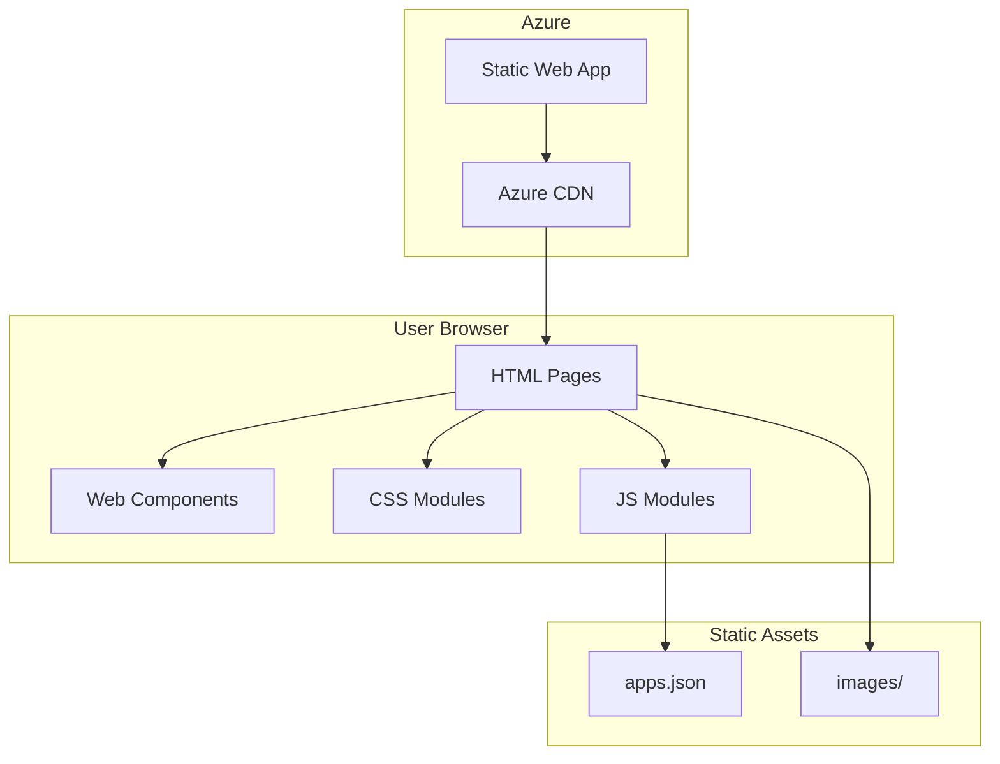
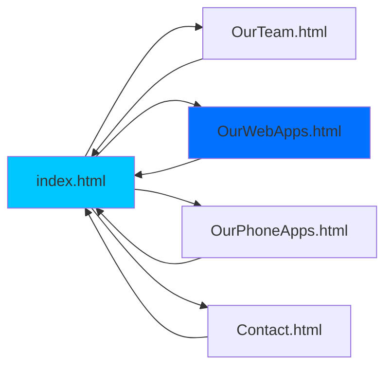
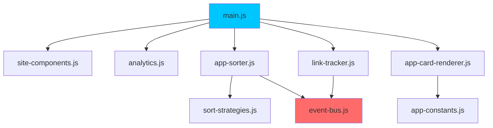
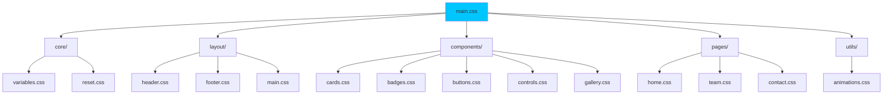
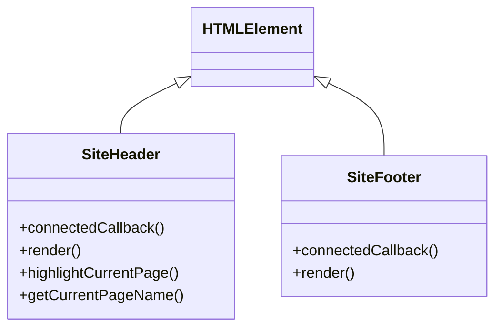
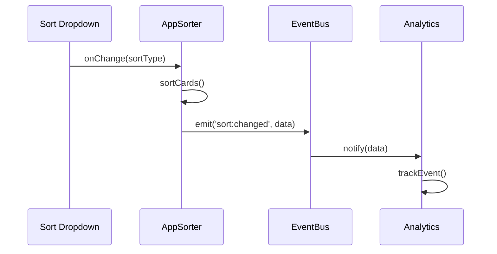
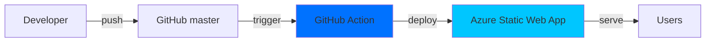
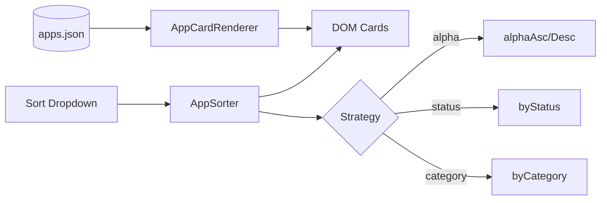

# Architecture Documentation

## System Overview

## Page Flow

## JavaScript Module Dependencies

## CSS Module Architecture

## Web Components

## Event Bus Pattern

## CI/CD Pipeline

## Data Flow (OurWebApps Page)

