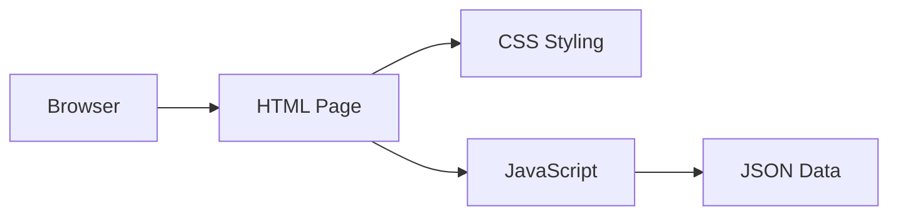
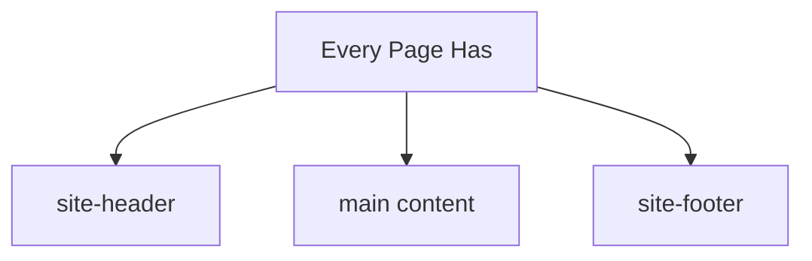
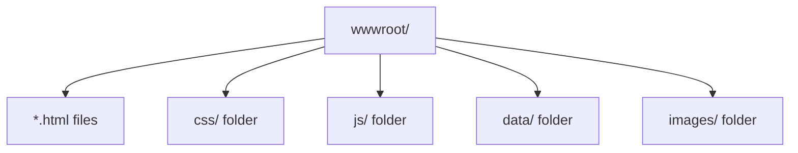
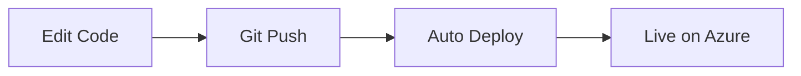

# Quick Start Guide

Simple diagrams for understanding the project structure.

## How It Works

## Page Structure

## File Organization

## Making Changes

| What to Change | Where to Edit |
|----------------|---------------|
| Page content | `*.html` files |
| Colors/styles | `css/core/variables.css` |
| Header/Footer | `js/components/site-components.js` |
| App list | `data/apps.json` |

## Deployment

That's it! No build tools, no npm, just simple web files.
